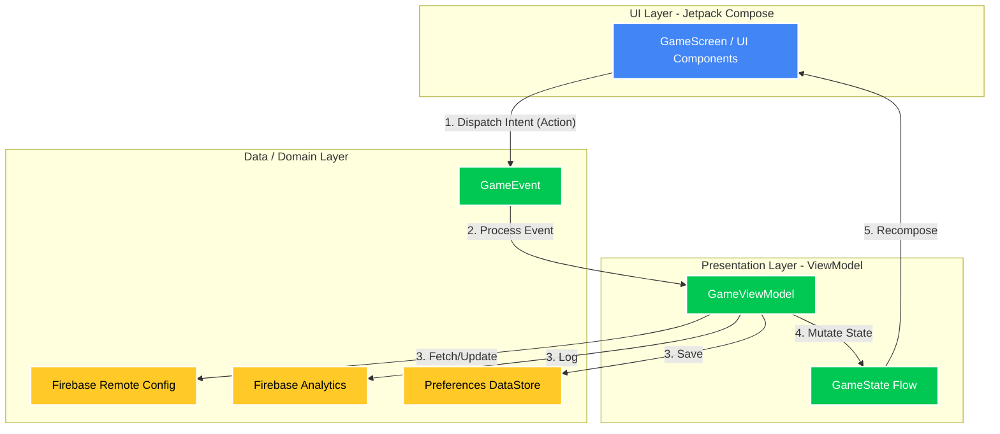
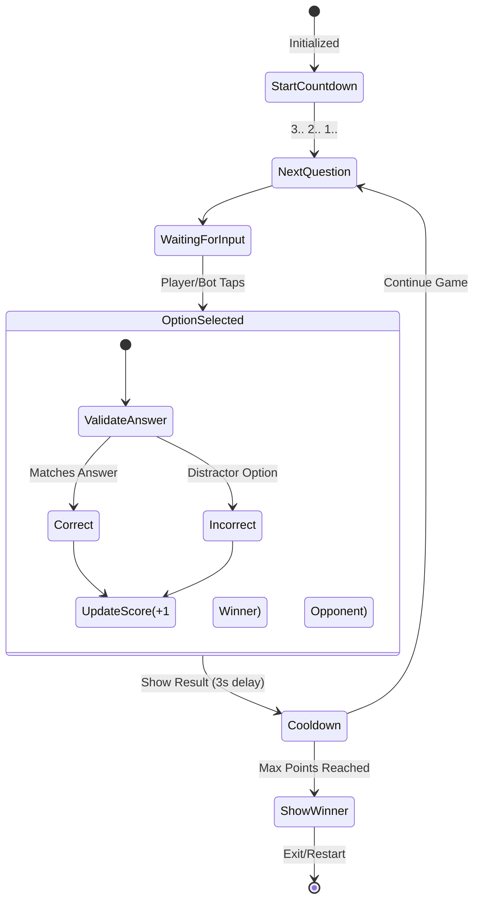

<div align="center">

# MathGame: 1v1 Split-Screen Challenge

**A fast-paced, competitive 1v1 math puzzle game built completely with modern Android technologies.**


</div>

---

## Overview

**MathGame** is a native Android application designed to test your calculation speed and accuracy under pressure. Whether challenging a friend in local **1v1 Split-Screen** or battling an adaptive **Bot**, players must solve dynamically generated modular math equations faster than their opponent. 

Designed with a heavy focus on clean code, scalable architecture, and a modern reactive UI, MathGame is built from the ground up using **Jetpack Compose** with an **Event-Driven MVI (Model-View-Intent)** architecture.

---

## Key Features

- **Local 1v1 Multiplayer**: Innovative split-screen UI allows two players to compete simultaneously on the same device.
- **Adaptive Bot Opponents**: Play solo against an AI with three difficulty tiers (Easy, Medium, Hard). The bot's cognitive delay and accuracy dynamically scale based on the selection.
- **Dynamic Equation Generation**: Never see the same game twice. Operands and operations are generated procedurally per round, with intelligently dispersed "distractor" options.
- **Real-Time Remote Configuration**: Integrated with Firebase Remote Config to dynamically alter theme colors, bot behaviors, and maximum winning points *without over-the-air updates*.
- **Data Persistence**: Tracks rounds and high scores locally using Android DataStore.
- **Analytics & Crash Reporting**: Enterprise-grade monitoring using Firebase Analytics and Crashlytics.

---

## Screenshots

<div align="center">
  
</div>

> *Note: App employs dynamic theme colors fetched via Remote Config.*

---

## Technical Architecture

The application strictly adheres to the **MVI (Model-View-Intent)** presentation pattern and **Clean Architecture** principles. This ensures unidirectional data flow, making state management predictable and the UI highly reactive.

### High-Level Architecture (MVI)



### Game Logic & Flow State Machine

The core matching logic is executed completely reactively. Both the player and the bot compete to update the single source of truth (`GameState`).



---

## 🤖 Bot Logic Deep-Dive

The solo-mode bot simulates human response times and error rates based on the `BotLevel` configuration.

- **Easy**: Higher latency (simulated cognitive delay), higher chance to select a distractor option.
- **Medium**: Balanced latency and accuracy.
- **Hard**: Near-instantaneous response times with near-perfect accuracy. A massive stress test for the player.

---

## Tech Stack

- **UI**: [Jetpack Compose](https://developer.android.com/jetpack/compose) (Animation, Foundation, Material 3)
- **Architecture components**: `ViewModel`, `StateFlow`, `Navigation Compose`
- **Dependency Injection**: [Dagger Hilt](https://dagger.dev/hilt/)
- **Asynchronous Programming**: [Kotlin Coroutines](https://kotlinlang.org/docs/coroutines-overview.html) & Flow
- **Local Storage**: [Preferences DataStore](https://developer.android.com/topic/libraries/architecture/datastore)
- **Cloud/BaaS (Firebase)**:
  - `Remote Config`: Dynamic game rules & theming.
  - `Analytics`: User event tracking (`GAME_COMPLETED`, `EXIT_GAME`).
  - `Crashlytics`: Real-time crash monitoring.
- **Serialization**: `kotlinx.serialization`

---

## Getting Started

### Prerequisites
- Android Studio Ladybug (or newer IDE supporting AGP 8+)
- JDK 17+
- A valid `google-services.json` file from Firebase (required to build the app).

### Installation

1. **Clone the repository:**
   ```bash
   git clone https://github.com/amEya911/MathGame.git
   ```
2. **Open the project in Android Studio.**
3. **Add Firebase Credentials:**
   - Create a Firebase project in the console.
   - Add an Android App with the package name `eu.tutorials.mathgame`.
   - Download the `google-services.json` file and place it in the `app/` directory.
4. **Build and Run:**
   - Sync Gradle.
   - Select an emulator or physical device.
   - Click **Run** (Cmd+R / Shift+F10).

---

## Contributing

Contributions, issues, and feature requests are welcome!
Feel free to check out the [issues page](https://github.com/amEya911/MathGame/issues) if you want to contribute.

---

## License

This project is licensed under the MIT License.

<div align="center">
  <i>Crafted with ❤️ by Ameya Kulkarni</i>
</div>
